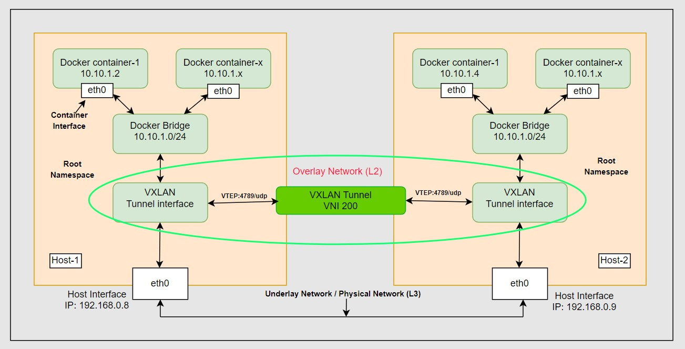

**Implementing Multi-Host Docker Networking with VXLAN and Docker:**
===

To understand VXLAN (Virtual Extensible LAN) and its operation effectively, it is beneficial to have a grasp of the following networking concepts:

## Underlay Network:
The underlay network is a layer 3 (L3) IP network. The underlay network, also known as the physical network or transport network, refers to the physical infrastructure that provides the basic connectivity and packet forwarding capabilities for data transmission between devices and endpoints in a computer network.  It refers to the network of switches, routers, cables, and other networking devices that operate at the lower layers of the OSI (Open Systems Interconnection) model.

## Overlay  Network:
An overlay network is a virtual network that runs on top of an existing physical network infrastructure, also known as the underlay network. Overlay networks are used to create virtualized or logical communication paths between devices and endpoints that may not be directly connected in the physical network. With VXLAN, the overlay is a layer 2 (L2) Ethernet network. 

## What is VXLAN?
VXLAN, which stands for Virtual Extensible LAN, is a network encapsulation protocol used to create overlay networks over existing network infrastructures, such as traditional data center networks or the Internet. It is designed to address the scalability and flexibility limitations of traditional VLANs (Virtual LANs) by extending Layer 2 (data link layer) segments over an IP (Layer 3) network.
The main purpose of VXLAN is to allow virtual machines (VMs) or workloads running in different physical or virtualized environments to communicate with each other as if they were on the same local network, even if they are physically located in different data centers or cloud providers. 

The main components of VXLAN are as follows:

- VTEP stands for "VXLAN Tunnel Endpoint." It is a critical component in VXLAN technology, responsible for encapsulating and decapsulating VXLAN frames as they traverse between the overlay network (VXLAN) and the underlay network. By using VTEPs, VXLAN enables Layer 2 connectivity and communication between virtual machines and workloads across Layer 3 (IP) networks.  The VTEP encapsulates the traffic in UDP and IP headers. UDP port 4789 is used as the destination port. The traffic is sent over the IP network

- VNI stands for "VXLAN Network Identifier." It is a 24-bit field used in VXLAN technology to uniquely identify different virtual Layer 2 segments within an overlay network. 
_The VXLAN Network Identifier (VNI) identifies the VXLAN and has a similar function as the VLAN ID for regular VLANs. It is typically a 24-bit value part of the VXLAN header, which can support up to 16 million individual network segments, compared with the 4,096 limit for VLANs (as opposed to 12-bit VLAN ID)._

## Topology diagram of the VXLAN: 



Here's a step-by-step guide to creating VXLAN overlay networks:


Please note that manipulating VXLAN requires administrative privileges, so you might need to use 'sudo' to execute some of these commands. For this demonstration we used Ubuntu (20.04 LTS) VMs on VMware Workstation.

## Prerequisites:
- Running on your host machines (Host-1 & Host-2) and ensure the  communicating each other.
- Docker Engine is installed both hosts. 
- Make sure you have a Linux kernel that supports VxLAN.


## _Step-1: Install docker engine and create a subnet using docker network utility:_
Host-1:
```
# Update the repository and install docker engine with necessary tools:

sudo apt update
sudo apt install bridge-utils net-tools iputils-ping -y 
sudo apt install docker.io -y
```

```
# The below command will create a 'vxlan_1' network with a default bridge network driver:

sudo docker network create --subnet 10.10.1.0/16 vxlan_1
```

```
# List of all networks in docker: 

sudo docker network ls

NETWORK ID     NAME      DRIVER    SCOPE
b53eb1ad2e99   bridge    bridge    local
2b5c2b44025b   host      host      local
2e2fadee0dcf   none      null      local
118210041af6   vxlan_1   bridge    local
```

```
# Check the bridge interfaces:

ip a
........ 
........ 

4: br-118210041af6: <NO-CARRIER,BROADCAST,MULTICAST,UP> mtu 1500 qdisc noqueue state DOWN group default
    link/ether 02:42:1c:75:eb:4e brd ff:ff:ff:ff:ff:ff
    inet 10.10.0.1/16 brd 10.10.255.255 scope global br-118210041af6
       valid_lft forever preferred_lft forever

```

Host-2:
```
# Update the repository and install docker engine with necessary tools:

sudo apt update
sudo apt install bridge-utils net-tools iputils-ping -y 
sudo apt install docker.io -y
```

```
# The below command will create a 'vxlan_1' network with a default bridge network driver:

sudo docker network create --subnet 10.10.1.0/16 vxlan_1
```

```
# List of all networks in docker: 

sudo docker network ls

NETWORK ID     NAME      DRIVER    SCOPE
19f331dd5f20   bridge    bridge    local
65baccff8e68   host      host      local
0c1562801066   none      null      local
0115b318427f   vxlan_1   bridge    local
```

```
# Check the bridge interfaces:

ip a
........ 
........ 

4: br-0115b318427f: <NO-CARRIER,BROADCAST,MULTICAST,UP> mtu 1500 qdisc noqueue state DOWN group default
    link/ether 02:42:55:2c:7a:6a brd ff:ff:ff:ff:ff:ff
    inet 10.10.0.1/16 brd 10.10.255.255 scope global br-0115b318427f
       valid_lft forever preferred_lft forever

```

## _Step-2:  Create a docker container on top of newly created docker bridge network:_

Host-1:
```
# Create docker container with static ip:

sudo docker run --name ubuntu -dit --network vxlan_1 --ip 10.10.0.2 ubuntu
```

```
# Check the container running or not:

sudo docker ps -a

CONTAINER ID   IMAGE     COMMAND       CREATED          STATUS         PORTS     NAMES
caff0282fa80   ubuntu    "/bin/bash"   10 seconds ago   Up 9 seconds             ubuntu
```

```
# Check the IPAddress to make sure that the ip assigned properly:

sudo docker inspect ubuntu | grep IPAddress

            "SecondaryIPAddresses": null,
            "IPAddress": "",
                    "IPAddress": "10.10.0.2",
```

```
# Let's check ping one of the docker bridge ip and running container IP on the host.

# Docker bridge ip:

ping 10.10.0.1

PING 10.10.0.1 (10.10.0.1) 56(84) bytes of data.
64 bytes from 10.10.0.1: icmp_seq=1 ttl=64 time=0.109 ms
64 bytes from 10.10.0.1: icmp_seq=2 ttl=64 time=0.107 ms
64 bytes from 10.10.0.1: icmp_seq=3 ttl=64 time=0.082 ms


# Container IP:

ping 10.10.0.2

PING 10.10.0.2 (10.10.0.2) 56(84) bytes of data.
64 bytes from 10.10.0.2: icmp_seq=1 ttl=64 time=0.308 ms
64 bytes from 10.10.0.2: icmp_seq=2 ttl=64 time=0.058 ms
64 bytes from 10.10.0.2: icmp_seq=3 ttl=64 time=0.113 ms


```

Host-2:
```
# Create docker container with static ip:

sudo docker run --name ubuntu -dit --network vxlan_1 --ip 10.10.0.4 ubuntu
```

```
# Check the container running or not:

sudo docker ps -a

CONTAINER ID   IMAGE     COMMAND       CREATED          STATUS         PORTS     NAMES
c14e343ef613   ubuntu    "/bin/bash"   6 seconds ago   Up 4 seconds             ubuntu

```

```
# Check the IPAddress to make sure that the ip assigned properly:

sudo docker inspect ubuntu | grep IPAddress

            "SecondaryIPAddresses": null,
            "IPAddress": "",
                    "IPAddress": "10.10.0.4",

```

```
# Let's check ping one of the docker bridge ip and running containers IP on the host.

# Docker bridge ip:

ping 10.10.0.1

PING 10.10.0.1 (10.10.0.1) 56(84) bytes of data.
64 bytes from 10.10.0.1: icmp_seq=1 ttl=64 time=0.050 ms
64 bytes from 10.10.0.1: icmp_seq=2 ttl=64 time=0.095 ms
64 bytes from 10.10.0.1: icmp_seq=3 ttl=64 time=0.092 ms


# Container IP:

ping 10.10.0.4

PING 10.10.0.4 (10.10.0.4) 56(84) bytes of data.
64 bytes from 10.10.0.4: icmp_seq=1 ttl=64 time=0.199 ms
64 bytes from 10.10.0.4: icmp_seq=2 ttl=64 time=0.124 ms
64 bytes from 10.10.0.4: icmp_seq=3 ttl=64 time=0.048 ms

```

## _Step-3: Now, access to the running docker container and install necessary tools for connectivity test:_

Host-1:
```
# Now, enter the running container:

sudo docker exec -it <container_name or container_id> bash

sudo docker exec -it ubuntu bash
```

```
# Now, we are inside running container and install packages: 

apt update
apt install net-tools -y
apt install iputils-ping -y
```

```
# Check the container interface and IP:

ifconfig

eth0: flags=4163<UP,BROADCAST,RUNNING,MULTICAST>  mtu 1500
        inet 10.10.0.2  netmask 255.255.0.0  broadcast 10.10.255.255
        ether 02:42:0a:0a:00:02  txqueuelen 0  (Ethernet)
        RX packets 8717  bytes 27337602 (27.3 MB)
        RX errors 0  dropped 0  overruns 0  frame 0
        TX packets 4919  bytes 376018 (376.0 KB)
        TX errors 0  dropped 0 overruns 0  carrier 0  collisions 0

```

```
# Exit the inside of the container:

exit
```

Host-2:
```
# Now, enter the running container:

sudo docker exec -it <container_name or container_id> bash

sudo docker exec -it ubuntu bash
```

```
# Now, we are inside running container and install packages: 

apt update
apt install net-tools -y
apt install iputils-ping -y
```

```
# Check the container interface and IP:

ifconfig

eth0: flags=4163<UP,BROADCAST,RUNNING,MULTICAST>  mtu 1500
        inet 10.10.0.4  netmask 255.255.0.0  broadcast 10.10.255.255
        ether 02:42:0a:0a:00:04  txqueuelen 0  (Ethernet)
        RX packets 10102  bytes 26996613 (26.9 MB)
        RX errors 0  dropped 0  overruns 0  frame 0
        TX packets 5260  bytes 439465 (439.4 KB)
        TX errors 0  dropped 0 overruns 0  carrier 0  collisions 0

```

```
# Exit the inside of the container:

exit
```

## _Step-4: For establish communication between the running containers, we need to create a VxLAN tunnel and attach it to the Docker bridge. Make sure the VNI ID is the same for both hosts:_ 

Host-1:
```
# Create a vxlan:
# Name 'vxlan200' is the name of the interface, type should be 'vxlan'
# VNI ID is 200
# Should be dstport 4789 which a udp standard port for vxlan communication
# IP of the Host-2: 192.168.0.9

sudo ip link add vxlan200 type vxlan id 200 remote 192.168.0.9 dstport 4789 dev ens160
```

```
# Enable of the vxlan interface:

sudo ip link set vxlan200 up
```

```
# Check interface list if the vxlan interface created:

ip a | grep vxlan

.........
.........
7: vxlan200: <BROADCAST,MULTICAST,UP,LOWER_UP> mtu 1450 qdisc noqueue state UNKNOWN group default qlen 1000
```

```
# Check the list of docker bridge name on the host:

sudo brctl show

bridge name       bridge id               STP enabled     interfaces
br-118210041af6   8000.02421c75eb4e       no              vethe2df851
docker0           8000.0242cfff25fc       no
```

```
# Now, attach the newly created vxlan interface to the docker bridge: 

sudo brctl addif br-118210041af6 vxlan200

```

Host-2:
```
# Create a vxlan:
# Name 'vxlan200' is the name of the interface, type should be vxlan
# VNI ID is 200
# Should be dstport 4789 which a udp standard port for vxlan communication
# IP of the Host-1: 192.168.0.8

sudo ip link add vxlan200 type vxlan id 200 remote 192.168.0.8 dstport 4789 dev ens160
```

```
# Enable of the vxlan interface:

sudo ip link set vxlan200 up
```

```
# Check interface list if the vxlan interface created:

ip a | grep vxlan

.........
.........
9: vxlan200: <BROADCAST,MULTICAST,UP,LOWER_UP> mtu 1450 qdisc noqueue state UNKNOWN group default qlen 1000
```

```
# Check the list of docker bridge name on the host:

sudo brctl show

bridge name       bridge id               STP enabled     interfaces
br-0115b318427f   8000.0242552c7a6a       no              veth650a3f2
docker0           8000.0242e5f1e61c       no
```

```
# Now, attach the newly created vxlan interface to the docker bridge: 

sudo brctl addif br-0115b318427f vxlan200
```

## _Step-5: After that the VxLAN overlay network tunnel has been created, then testing Communication between two Containers:_

Host-1:
```
# Now, check the rounting table:

route -n

Kernel IP routing table
Destination     Gateway         Genmask         Flags Metric Ref    Use Iface
0.0.0.0         192.168.0.1     0.0.0.0         UG    0      0        0 ens160
10.10.0.0       0.0.0.0         255.255.0.0     U     0      0        0 br-118210041af6
172.17.0.0      0.0.0.0         255.255.0.0     U     0      0        0 docker0
192.168.0.0     0.0.0.0         255.255.255.0   U     0      0        0 ens160
```

```
# Now, enter the running container:

sudo docker exec -it ubuntu bash
```

```
# ping the Host-2 container IP:

ping 10.10.0.4

PING 10.10.0.4 (10.10.0.4) 56(84) bytes of data.
64 bytes from 10.10.0.4: icmp_seq=1 ttl=64 time=2.37 ms
64 bytes from 10.10.0.4: icmp_seq=2 ttl=64 time=1.89 ms
64 bytes from 10.10.0.4: icmp_seq=3 ttl=64 time=1.28 ms

```


Host-2:
```
# Now check the rounting table:

route -n

Kernel IP routing table
Destination     Gateway         Genmask         Flags Metric Ref    Use Iface
0.0.0.0         192.168.0.1     0.0.0.0         UG    0      0        0 ens160
10.10.0.0       0.0.0.0         255.255.0.0     U     0      0        0 br-0115b318427f
172.17.0.0      0.0.0.0         255.255.0.0     U     0      0        0 docker0
192.168.0.0     0.0.0.0         255.255.255.0   U     0      0        0 ens160
```

```
# Now, enter the running container:

sudo docker exec -it ubuntu bash
```

```
# ping the Host-1 container IP:

ping 10.10.0.2

PING 10.10.0.2 (10.10.0.2) 56(84) bytes of data.
64 bytes from 10.10.0.2: icmp_seq=1 ttl=64 time=1.32 ms
64 bytes from 10.10.0.2: icmp_seq=2 ttl=64 time=1.18 ms
64 bytes from 10.10.0.2: icmp_seq=3 ttl=64 time=1.07 ms

```

_That's it! You have now set up Multi-Host Docker Networking with VXLAN and Docker. Containers running on different hosts can now communicate with each other using the overlay network._


`See More:`
--
[MEDIUM](https://medium.com/@technbd)


